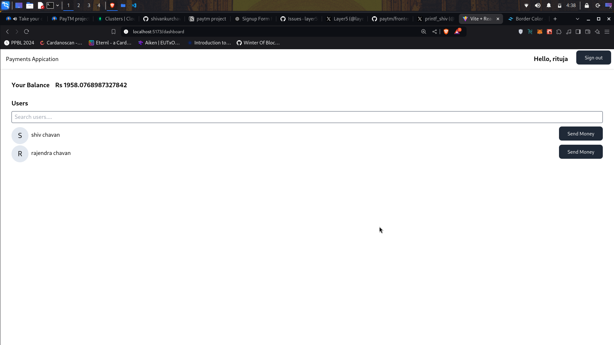
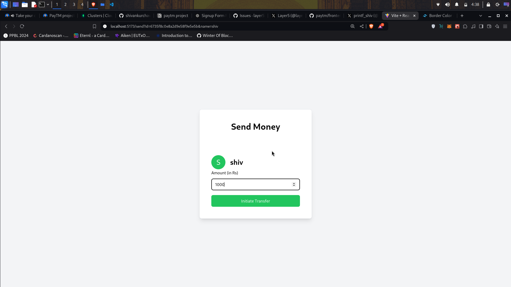
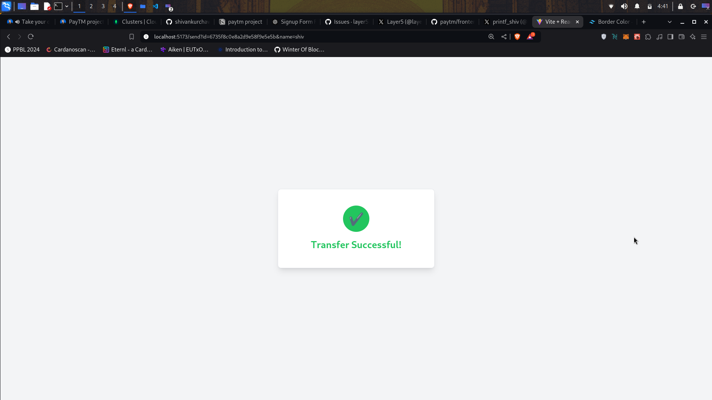
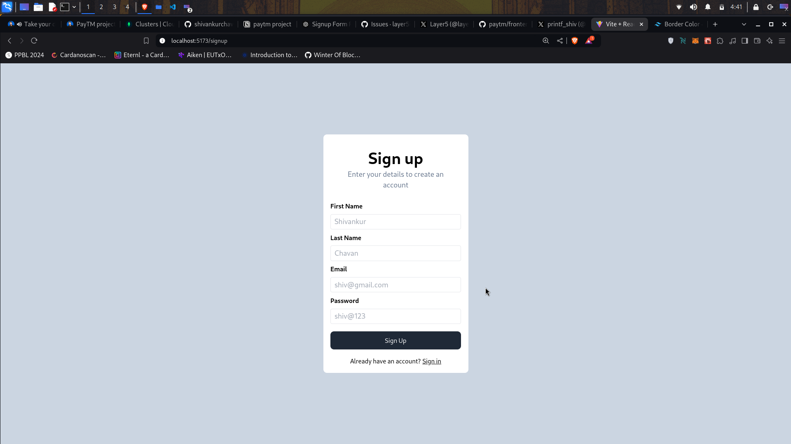
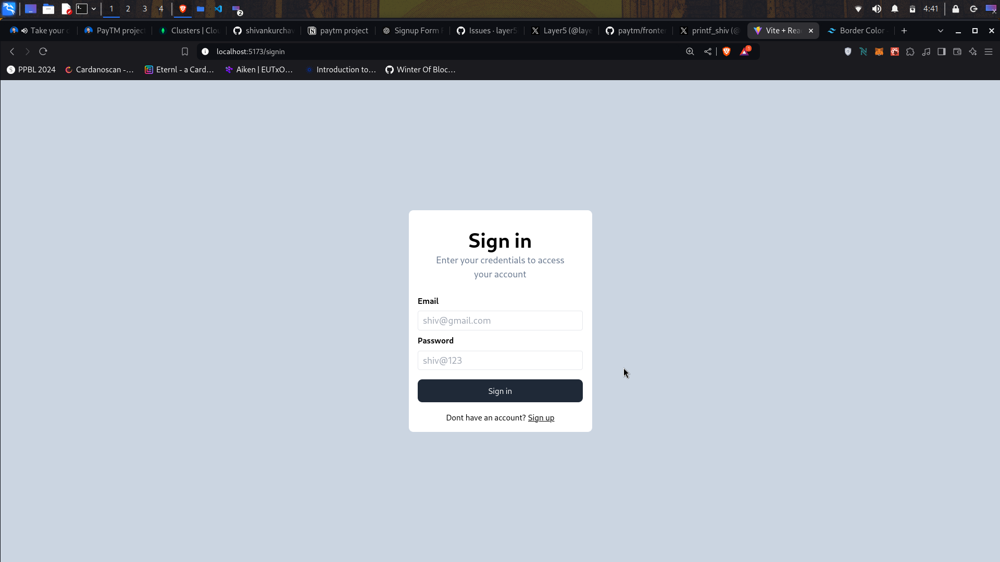

# Payments Application

A full-stack payments app with user authentication and money transfer capabilities.

## Technologies Used
- **Frontend**: React, React Router, Tailwind CSS, Axios
- **Backend**: Node.js, Express, MongoDB, Mongoose, JWT
- **Development Tools**: Docker, Vite

## Features
- User authentication via JWT
- Send money between users
- View account balance
- User search functionality

## Setup

1. Clone the repo:
   ```bash
   git clone https://github.com/shivankurchavan/PayTM.git
   cd PayTM
   ```
2. Set up `.env` file in backend folder with your mongo url :
   ```bash
   MONGO_URL=your-mongo-url
   ```

3. Set up `config.js` file in backend folder with your jwt secret :
   ```js
   module.exports={
    JWT_SECRET:"yadayada",
   }
   ```
4. Set up the backend:
   ```bash
   cd backend
   npm install
   node index.js
   ```

5. Set up the frontend:
   ```bash
   cd frontend
   npm install
   npm run dev
   ```
## Screenshots






## License
This project is licensed under the MIT License.
